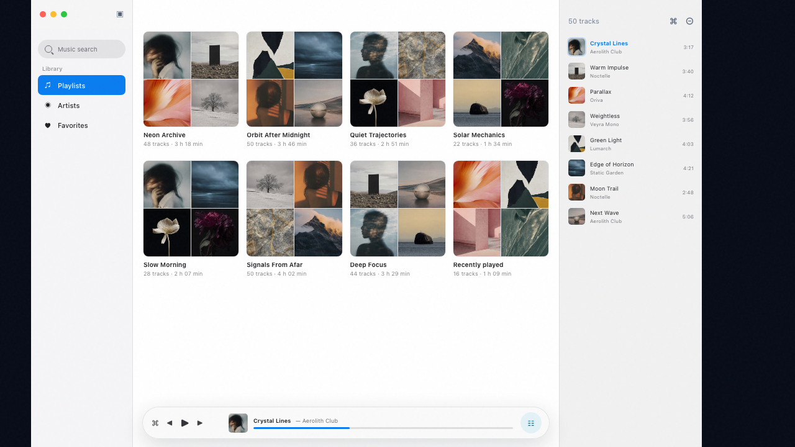
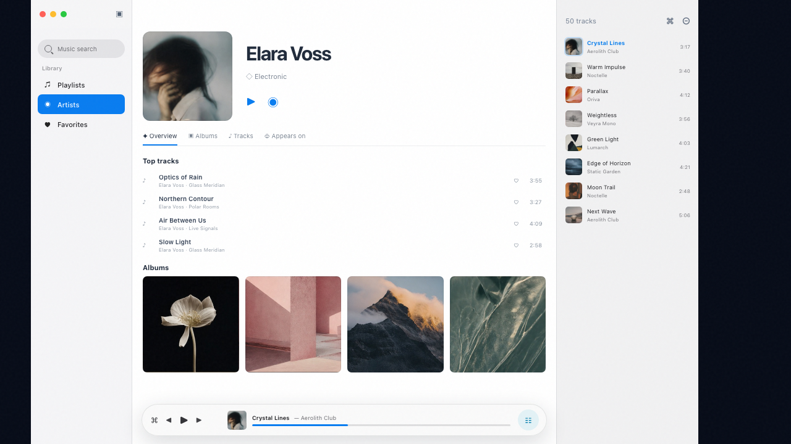

**English** | [Русский](README.ru.md)

# Jellia

A native music client for [Jellyfin](https://jellyfin.org) on macOS. SwiftUI, no Electron and no
web views: library, player and search are a regular Mac app.

[jellia website](https://cjbars.github.io/jellia/) · [latest release](https://github.com/cjbars/jellia/releases/latest)





<sub>Interface mockups — the album artwork is placeholder imagery, not a real library.</sub>

## Features

- library browsing: artists, albums, playlists and favorites with artwork;
- playback through AVFoundation with progress reporting — position and history stay in sync with
  other Jellyfin clients;
- Now Playing integration: artwork and controls in Control Center, on media keys and in the Dynamic Island;
- Instant Mix radio from a track, album, artist or playlist;
- search across tracks, albums, artists and playlists;
- favorites toggled straight from any list;
- artwork cache with a configurable size; credentials are stored in the macOS Keychain.

## Requirements

- macOS 26 or newer;
- a Jellyfin server (see the table below);
- to build from source — Xcode command line tools with the macOS 26 SDK.

## Supported server versions

A single build works with every supported server version: the version is detected on connect and
shown in Settings.

| Jellyfin version | Status |
| --- | --- |
| `12.0` | used for development |
| `10.11` | supported |
| below `10.11` | untested, the app will say so |

The endpoints Jellia uses are identical in `10.11` and `12.0`: paths, request parameters and response
schemas all match, so a per-version build would carry no difference. Once a breaking change does
appear, it goes into a compatibility layer inside the client rather than into a separate build.

## Install

Grab `Jellia-<version>.dmg` from the [releases](../../releases) page and drag the app to Applications.

Builds are not signed with an Apple Developer ID certificate, so macOS will warn you on first launch.
Clear the quarantine flag:

```bash
xattr -dr com.apple.quarantine /Applications/Jellia.app
```

or open the app from its context menu → Open and confirm.

On first launch enter the server address, username and password. macOS will ask for local network
access if the server lives on your LAN — without it the app cannot connect.

## Build from source

Neither Swift Package Manager nor an Xcode project is used: the app is built with `swiftc` from the `Makefile`.

```bash
make check   # typecheck + tests
make build   # build/Jellia.app
make run     # build and launch
make install # install into /Applications
make dmg     # build/Jellia-<version>.dmg
```

Version can be overridden with `make build VERSION=0.1.6`; the build number is derived from it
(`0.1.6` → `10600`) and can be overridden too: `BUILD_NUMBER=10601`.
A universal binary is produced with `make dmg ARCHS="arm64 x86_64"`.
The build must pass with `-swift-version 6 -strict-concurrency=complete -warnings-as-errors`.

## License

[MIT](LICENSE).

Jellia is an independent project and is not affiliated with the Jellyfin team.
